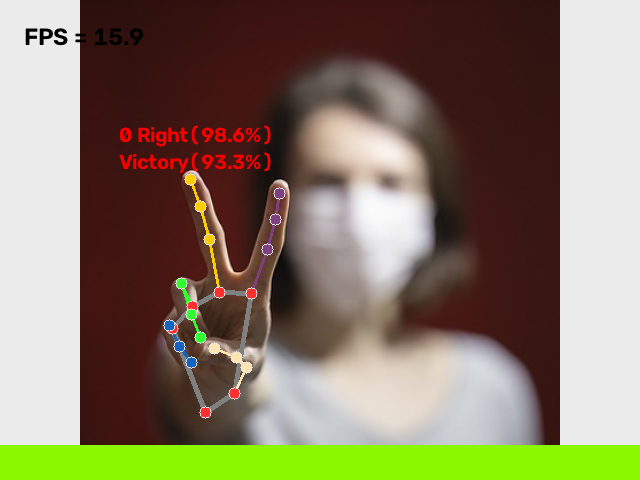

# 💡 IO LightSystem — Gesture-Controlled Lighting

[](https://www.python.org/)
[](https://opencv.org/)
[](https://developers.google.com/mediapipe)
[](https://www.espressif.com/)
[](https://www.nxp.com/)
[](LICENSE)

> 🇵🇱 [Polish version](README.pl.md)

> 🗓️ **Project period:** 2023–2024

> 📘 [Technical documentation](docs/TECHNICAL_DOCUMENTATION.md)

A **hand-gesture–controlled lighting system**. A Python app recognizes hand gestures from a webcam using **MediaPipe** and **OpenCV**, and sends the recognized gesture over a **serial link** to a microcontroller that drives an **RGB NeoPixel LED strip** — so a wave of the hand changes the light.

The project started as a **Software Engineering course project** framed around intelligent lighting (the European road-lighting standard **PN-EN 13201**, cited in the [external references](docs/REFERENCES.md), was the initial inspiration) and evolved into this gesture-controlled RGB demo. It was also one of the inspirations for the engineering thesis **AI Sign Language Translator**.

## ✨ Features

- ✋ **Real-time hand-gesture recognition** — MediaPipe Gesture Recognizer (`src/gesture_recognizer.task`) over an OpenCV camera stream
- 🎨 **7 gestures → colors & commands** — each recognized gesture maps to a color on an on-screen bar and to a control byte sent to the LED controller
- 🔌 **Serial control** — gestures are streamed over a serial port (9600 baud, 8N1) to the microcontroller
- 🔧 **Two interchangeable firmware implementations** — **NXP LPC (LPCXpresso, C++)** and an alternative **ESP8266 (Arduino)** controller, both driving a NeoPixel strip through the same serial protocol
- ⚙️ **Configurable** — camera id/resolution, controlling hand (left/right), detection/tracking confidence, image mirroring, color-bar visibility, output mode and serial port (all via CLI flags)

## Interface



*Actual application output: MediaPipe recognized `Victory` at 93.3%, drew the hand landmarks and displayed the gesture's green color bar. For a repeatable capture, the official [`Victory` test image from the MediaPipe Python sample](https://github.com/google-ai-edge/mediapipe-samples/blob/main/examples/gesture_recognizer/python/gesture_recognizer.ipynb) was replayed as a camera stream; a physical webcam uses the same capture, inference and rendering path.*

## 🖐️ Gesture map

| Gesture | On-screen color | Serial byte |
|---------|-----------------|-------------|
| 👍 `Thumb_Up` | Green | `A` |
| 👎 `Thumb_Down` | Magenta | `B` |
| ✋ `Open_Palm` | Blue | `C` |
| ✊ `Closed_Fist` | Yellow | `D` |
| ✌️ `Victory` | Spring green | `E` |
| ☝️ `Pointing_Up` | Cyan | `F` |
| 🤟 `ILoveYou` | Red | `G` |
| *(none / unknown)* | White | `X` |

## 🧩 How it works


## 📂 Repository structure

| Path | Description |
|------|-------------|
| `src/main.py` | Application — camera capture, gesture recognition, color bar, serial output |
| `src/gesture_recognizer.task` | MediaPipe Gesture Recognizer model bundle |
| `src/requirements.txt` | Python dependencies (MediaPipe, OpenCV, pySerial) |
| `embedded/esp_8266_Arduino/` | ESP8266 (Arduino) NeoPixel LED-controller firmware |
| `embedded/IO_LedController_CPP/` | NXP LPC (LPCXpresso, C++) NeoPixel LED-controller firmware |
| `docs/` | Project documentation, screenshot and links to external references |
| `CHANGELOG.md` | Release history |
| `THIRD_PARTY_NOTICES.md` | Bundled third-party components, direct dependencies and licenses |

## 🚀 Getting started

### 1. Python app

Use **Python 3.9–3.12**. The release pins MediaPipe `0.10.35`, which provides the Tasks drawing API used by the application.

```bash
git clone https://github.com/Kamilr616/IO_LightSystem.git
cd IO_LightSystem
pip install -r src/requirements.txt
python src/main.py --serialPort COM3        # Windows
# python src/main.py --serialPort /dev/ttyACM0   # Linux
```

Run `python src/main.py --help` for all options. Useful flags:

| Flag | Meaning | Default |
|------|---------|---------|
| `--version` | Show the application release version and exit | — |
| `--serialPort` | Serial port of the LED controller | `/dev/ttyACM0` |
| `--outputMode` | `0` = none, `1` = serial | `1` |
| `--cameraId` | Camera index | `0` |
| `--controlHand` | `0` = right, `1` = left | `0` |
| `--mirrorImage` | `0` = no mirror, `1` = mirror | `0` |
| `--barVisibility` | `0` = hide color bar, `1` = show | `1` |
| `--numHands` | Max hands to detect | `2` |

Run the CLI tests with `python -m unittest discover -s tests`.

### 2. LED controller firmware

The repository provides two interchangeable controller implementations. Flash
**one** of them and wire a NeoPixel strip:

- **NXP LPC (LPCXpresso):** open `embedded/IO_LedController_CPP/` in MCUXpresso IDE and flash.
- **Alternative ESP8266 (Arduino):** open `embedded/esp_8266_Arduino/Led_controller_arduino/Led_controller_arduino.ino` in the Arduino IDE and upload.

Both variants accept the same `A`-`G` commands over a 9600 8N1 serial link, so
the Python application does not need to change when switching boards. See the
[technical documentation](docs/TECHNICAL_DOCUMENTATION.md) for their differences,
dependencies and flashing workflow.

## 👥 Team

| Member | Role | Profiles |
|--------|------|----------|
| **Kamil Rataj** | Author & maintainer — gesture app, serial protocol, firmware | [GitHub](https://github.com/Kamilr616) · [LinkedIn](https://www.linkedin.com/in/kamil-r-153ab7121/) |
| Mateusz Ciszek | Contributor | [GitHub](https://github.com/Matix351) |

## 📄 License

This project is licensed under the [MIT License](LICENSE). Bundled third-party components and direct dependencies are documented in [Third-Party Notices](THIRD_PARTY_NOTICES.md). Proprietary standards and vendor manuals are not distributed; use the [official external references](docs/REFERENCES.md).
