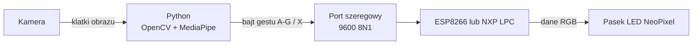

# 💡 IO LightSystem — oświetlenie sterowane gestami

[](https://www.python.org/)
[](https://opencv.org/)
[](https://developers.google.com/mediapipe)
[](https://www.espressif.com/)
[](https://www.nxp.com/)
[](LICENSE)

> 🇬🇧 [English version](README.md)

> 🗓️ **Okres realizacji:** 2023–2024

> 📘 [Dokumentacja techniczna](docs/TECHNICAL_DOCUMENTATION.pl.md)

**System oświetlenia sterowany gestami dłoni.** Aplikacja w Pythonie rozpoznaje gesty dłoni z kamery przy użyciu **MediaPipe** i **OpenCV**, a rozpoznany gest wysyła przez **łącze szeregowe (serial)** do mikrokontrolera, który steruje **paskiem LED RGB (NeoPixel)** — machnięcie dłonią zmienia światło.

Projekt powstał jako **projekt z Inżynierii Oprogramowania**, początkowo osadzony wokół inteligentnego oświetlenia (europejska norma oświetlenia drogowego **PN-EN 13201**, dołączona w [`docs/`](docs/), była pierwotną inspiracją) i ewoluował w to demo sterowania kolorem gestami. Był też jedną z inspiracji do pracy inżynierskiej **AI Sign Language Translator**.

## ✨ Funkcje

- ✋ **Rozpoznawanie gestów w czasie rzeczywistym** — MediaPipe Gesture Recognizer (`src/gesture_recognizer.task`) na strumieniu z kamery (OpenCV)
- 🎨 **7 gestów → kolory i komendy** — każdy gest mapuje się na kolor na pasku ekranowym oraz na bajt sterujący wysyłany do sterownika LED
- 🔌 **Sterowanie przez serial** — gesty strumieniowane portem szeregowym (9600 baud, 8N1) do mikrokontrolera
- 🔧 **Dwa warianty firmware** sterownika LED — **ESP8266 (Arduino)** oraz **NXP LPC (LPCXpresso, C++)**, oba sterujące paskiem NeoPixel
- ⚙️ **Konfigurowalność** — kamera (id/rozdzielczość), dłoń sterująca (lewa/prawa), progi detekcji/śledzenia, lustrzane odbicie obrazu, widoczność paska koloru, tryb wyjścia i port szeregowy (flagi CLI)

## Interfejs


*Rzeczywisty wynik aplikacji: MediaPipe rozpoznał gest `Victory` z pewnością 93,3%, narysował punkty dłoni i wyświetlił zielony pasek przypisany do gestu. Aby zrzut był powtarzalny, oficjalny [obraz testowy `Victory` z przykładu MediaPipe dla Pythona](https://github.com/google-ai-edge/mediapipe-samples/blob/main/examples/gesture_recognizer/python/gesture_recognizer.ipynb) został odtworzony jako strumień kamery; fizyczna kamera korzysta z tej samej ścieżki przechwytywania, inferencji i renderowania.*

## 🖐️ Mapa gestów

| Gest | Kolor na ekranie | Bajt serial |
|------|------------------|-------------|
| 👍 `Thumb_Up` | zielony | `A` |
| 👎 `Thumb_Down` | purpurowy | `B` |
| ✋ `Open_Palm` | niebieski | `C` |
| ✊ `Closed_Fist` | żółty | `D` |
| ✌️ `Victory` | spring green | `E` |
| ☝️ `Pointing_Up` | cyjan | `F` |
| 🤟 `ILoveYou` | czerwony | `G` |
| *(brak / nieznany)* | biały | `X` |

## 🧩 Jak to działa



## 📂 Struktura repozytorium

| Ścieżka | Opis |
|---------|------|
| `src/main.py` | Aplikacja — obraz z kamery, rozpoznawanie gestów, pasek koloru, wyjście serial |
| `src/gesture_recognizer.task` | Model MediaPipe Gesture Recognizer |
| `src/requirements.txt` | Zależności Pythona (MediaPipe, OpenCV, pySerial) |
| `embedded/esp_8266_Arduino/` | Firmware sterownika LED NeoPixel na ESP8266 (Arduino) |
| `embedded/IO_LedController_CPP/` | Firmware sterownika LED NeoPixel na NXP LPC (LPCXpresso, C++) |
| `docs/` | Dokumentacja projektu i norma PN-EN 13201 (pierwotna inspiracja) |

## 🚀 Szybki start

### 1. Aplikacja Python

Użyj **Pythona 3.9–3.12**. Plik wymagań instaluje MediaPipe `>=0.10.35,<0.11`, udostępniający API rysowania Tasks wykorzystywane przez aplikację.

```bash
git clone https://github.com/Kamilr616/IO_LightSystem.git
cd IO_LightSystem
pip install -r src/requirements.txt
python src/main.py --serialPort COM3        # Windows
# python src/main.py --serialPort /dev/ttyACM0   # Linux
```

Pełna lista opcji: `python src/main.py --help`. Przydatne flagi:

| Flaga | Znaczenie | Domyślnie |
|-------|-----------|-----------|
| `--serialPort` | Port szeregowy sterownika LED | `/dev/ttyACM0` |
| `--outputMode` | `0` = brak, `1` = serial | `1` |
| `--cameraId` | Indeks kamery | `0` |
| `--controlHand` | `0` = prawa, `1` = lewa | `0` |
| `--mirrorImage` | `0` = bez odbicia, `1` = odbicie | `0` |
| `--barVisibility` | `0` = ukryj pasek, `1` = pokaż | `1` |
| `--numHands` | Maks. liczba wykrywanych dłoni | `2` |

Testy interfejsu CLI uruchomisz poleceniem `python -m unittest discover -s tests`.

### 2. Firmware sterownika LED

Wgraj **jeden** ze sterowników na płytkę i podłącz pasek NeoPixel:

- **ESP8266 (Arduino):** otwórz `embedded/esp_8266_Arduino/Led_controller_arduino/Led_controller_arduino.ino` w Arduino IDE i wgraj.
- **NXP LPC (LPCXpresso):** otwórz `embedded/IO_LedController_CPP/` w MCUXpresso IDE i wgraj.

Sterownik odczytuje bajty sterujące z łącza szeregowego i ustawia kolor paska.

## 👥 Zespół

| Osoba | Rola |
|-------|------|
| **Kamil Rataj** | Autor i opiekun — aplikacja gestów, protokół serial, firmware |
| Mateusz Ciszek | Współtwórca |
| Natalia Martemianow | Współtwórczyni |

## 📄 Licencja

Projekt jest udostępniany na licencji [MIT](LICENSE). Normy, karty katalogowe i instrukcje podmiotów trzecich w `docs/` podlegają warunkom ich wydawców i nie są objęte licencją MIT.

## 👤 Autor

**Kamil Rataj** — [GitHub](https://github.com/Kamilr616) · [LinkedIn](https://www.linkedin.com/in/kamil-r-153ab7121/)
