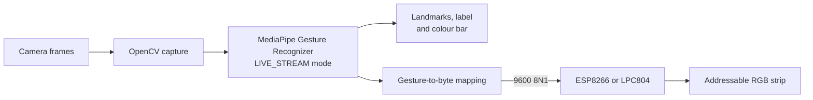

# Technical documentation

## Scope

IO LightSystem is a camera-to-lighting prototype. A Python process recognizes a
selected hand with MediaPipe Tasks, renders the result in an OpenCV window and,
when serial output is enabled, sends a one-byte command to LED-controller
firmware.



## Desktop process

`src/main.py` contains the CLI, camera loop, asynchronous recognition callback,
preview rendering and optional serial transport. The bundled
`src/gesture_recognizer.task` model is resolved relative to the script, so the
program does not depend on the current working directory.

The camera frame is converted from OpenCV BGR to MediaPipe SRGB and submitted to
`recognize_async` with a monotonically increasing millisecond timestamp. Results
from LIVE_STREAM mode are received in a callback. The configured left or right
hand is selected from detected hands; only that hand controls the preview colour
and serial command.

MediaPipe 0.10.35 uses the Tasks drawing helpers imported from
`mediapipe.tasks.python.vision`, including `drawing_utils`, `drawing_styles` and
`HandLandmarksConnections`. These imports are version-sensitive and should be
verified when upgrading MediaPipe.

## Command protocol

The link is raw ASCII at **9600 baud, 8 data bits, no parity and 1 stop bit**.

| Gesture label | Byte | Display/LED colour |
|---|---:|---|
| `Thumb_Up` | `A` | Green |
| `Thumb_Down` | `B` | Purple |
| `Open_Palm` | `C` | Blue |
| `Closed_Fist` | `D` | Yellow |
| `Victory` | `E` | Spring green |
| `Pointing_Up` | `F` | Cyan |
| `ILoveYou` | `G` | Red |
| Unknown/unsupported | `X` | No configured colour |

The Python sender writes only when no unread input is waiting on the serial
object; otherwise it clears the input buffer. This is not an acknowledged or
framed protocol: there is no checksum, sequence number or delivery confirmation.

## Interchangeable firmware implementations

The Python host is controller-independent. The repository contains an NXP LPC804
implementation and an alternative ESP8266/Arduino implementation; flash only
the variant matching the connected board. Both receive the same `A`-`G` command
set over a 9600 8N1 serial connection.

| Implementation | Target and toolchain | Source | LED handling |
|---|---|---|---|
| NXP LPC804 | LPCXpresso804, MCUXpresso IDE | `embedded/IO_LedController_CPP/` | Board-specific C++ NeoPixel driver |
| Alternative ESP8266/Arduino | ESP8266, Arduino IDE | `embedded/esp_8266_Arduino/Led_controller_arduino/Led_controller_arduino.ino` | Adafruit NeoPixel, 16 pixels on `D6`/GPIO12 |

### NXP LPC804

`embedded/IO_LedController_CPP/` is an MCUXpresso project containing its board,
SDK drivers, startup code and NeoPixel implementation. Its application receives
the same `A`-`G` command set and suppresses repeated bytes. Pin mux, clocks and
peripherals are board-specific and should be changed in MCUXpresso Config Tools,
not inferred from the Arduino sketch.

### Alternative implementation: ESP8266 / Arduino

`embedded/esp_8266_Arduino/Led_controller_arduino/Led_controller_arduino.ino`
provides the same serial-to-NeoPixel role without requiring NXP hardware. It uses
the Adafruit NeoPixel library with 16 pixels on Arduino pin `D6` (ESP8266 GPIO12),
maps `A` through `G` to colours and runs a theatre-chase animation. The last byte
is remembered, so an identical consecutive command does not restart the
animation. `X` and other bytes are ignored and do not clear the strip.

## Run and verify

Create an environment with a supported Python version and install the pinned
requirements:

```powershell
py -3.10 -m venv .venv
.\.venv\Scripts\Activate.ps1
python -m pip install -r src/requirements.txt
python src/main.py --outputMode 0
```

`--outputMode 0` runs camera recognition without opening a serial port. For a
controller, use for example `--outputMode 1 --serialPort COM3`. List all CLI
options with `python src/main.py --help`.

Run the automated CLI checks with:

```bash
python -m unittest discover -s tests -v
```

They verify parsing/defaults and the portable model path. A complete test still
requires a camera, the selected serial adapter, flashed firmware and an LED
strip. The LPC project is built and flashed with MCUXpresso IDE; the ESP8266
sketch uses Arduino IDE or an equivalent ESP8266 toolchain plus Adafruit NeoPixel.

## Failure modes and limitations

- Camera open/read failure or a missing model prevents recognition.
- With serial output enabled, an unavailable port terminates controller setup;
  use output mode 0 for vision-only operation.
- Recognition is asynchronous and frame results can be dropped under load.
- The byte protocol has no acknowledgement and unknown gestures do not send an
  explicit “lights off” command understood by the firmware.
- Automated tests do not exercise MediaPipe inference, physical serial transport
  or either microcontroller build.
