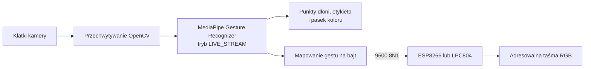

# Dokumentacja techniczna

## Zakres

IO LightSystem jest prototypem łączącym kamerę z oświetleniem. Proces Python
rozpoznaje wybraną dłoń przez MediaPipe Tasks, rysuje wynik w oknie OpenCV i, po
włączeniu wyjścia szeregowego, wysyła jednobajtową komendę do sterownika LED.



## Proces desktopowy

`src/main.py` zawiera CLI, pętlę kamery, asynchroniczny callback rozpoznawania,
podgląd i opcjonalny transport szeregowy. Model
`src/gesture_recognizer.task` jest wyszukiwany względem skryptu, więc program nie
zależy od bieżącego katalogu roboczego.

Klatka BGR z OpenCV jest konwertowana do SRGB MediaPipe i przekazywana do
`recognize_async` z rosnącym znacznikiem czasu w milisekundach. Wynik trybu
LIVE_STREAM trafia do callbacku. Spośród wykrytych dłoni wybierana jest
skonfigurowana lewa lub prawa; tylko ona steruje kolorem podglądu i komendą.

MediaPipe 0.10.35 używa narzędzi rysujących Tasks z
`mediapipe.tasks.python.vision`, w tym `drawing_utils`, `drawing_styles` i
`HandLandmarksConnections`. Importy zależą od wersji i trzeba je sprawdzić przy
aktualizacji MediaPipe.

## Protokół komend

Łącze przesyła surowy ASCII z parametrami **9600 baud, 8 bitów danych, brak
parzystości, 1 bit stopu**.

| Etykieta gestu | Bajt | Kolor podglądu/LED |
|---|---:|---|
| `Thumb_Up` | `A` | Zielony |
| `Thumb_Down` | `B` | Purpurowy |
| `Open_Palm` | `C` | Niebieski |
| `Closed_Fist` | `D` | Żółty |
| `Victory` | `E` | Wiosenna zieleń |
| `Pointing_Up` | `F` | Cyjan |
| `ILoveYou` | `G` | Czerwony |
| Nieznany/nieobsługiwany | `X` | Brak ustalonego koloru |

Python zapisuje bajt tylko wtedy, gdy obiekt serial nie ma oczekujących danych
wejściowych; w przeciwnym razie czyści bufor wejściowy. Protokół nie ma ramek,
sumy kontrolnej, numerów sekwencji ani potwierdzenia dostarczenia.

## Wymienne implementacje firmware

Aplikacja Python jest niezależna od wybranego mikrokontrolera. Repozytorium
zawiera implementację NXP LPC804 oraz alternatywną implementację ESP8266/Arduino;
należy wgrać wyłącznie wariant przeznaczony dla podłączonej płytki. Oba odbierają
ten sam zestaw komend `A`-`G` przez łącze szeregowe 9600 8N1.

| Implementacja | Platforma i narzędzia | Kod źródłowy | Obsługa LED |
|---|---|---|---|
| NXP LPC804 | LPCXpresso804, MCUXpresso IDE | `embedded/IO_LedController_CPP/` | Dedykowany sterownik NeoPixel w C++ |
| Alternatywna ESP8266/Arduino | ESP8266, Arduino IDE | `embedded/esp_8266_Arduino/Led_controller_arduino/Led_controller_arduino.ino` | Adafruit NeoPixel, 16 pikseli na `D6`/GPIO12 |

### NXP LPC804

`embedded/IO_LedController_CPP/` jest projektem MCUXpresso zawierającym pliki
płytki, sterowniki SDK, startup i obsługę NeoPixel. Aplikacja odbiera ten sam
zestaw `A`-`G` i pomija powtórzenia. Mux pinów, zegary i peryferia są zależne od
płytki i należy zmieniać je w MCUXpresso Config Tools, a nie kopiować ze szkicu
Arduino.

### Alternatywna implementacja: ESP8266 / Arduino

`embedded/esp_8266_Arduino/Led_controller_arduino/Led_controller_arduino.ino`
realizuje tę samą funkcję serial-to-NeoPixel bez konieczności używania sprzętu
NXP. Korzysta z biblioteki Adafruit NeoPixel dla 16 pikseli na pinie Arduino `D6`
(GPIO12 ESP8266), obsługuje `A`-`G`, mapuje je na kolory i uruchamia animację
theatre chase. Zapamiętuje ostatni bajt, dlatego identyczna kolejna komenda nie
restartuje animacji. `X` i pozostałe bajty są ignorowane i nie gaszą taśmy.

## Uruchamianie i weryfikacja

```powershell
py -3.10 -m venv .venv
.\.venv\Scripts\Activate.ps1
python -m pip install -r src/requirements.txt
python src/main.py --outputMode 0
```

`--outputMode 0` uruchamia kamerę bez portu szeregowego. Dla sterownika można użyć
np. `--outputMode 1 --serialPort COM3`. Wszystkie opcje pokazuje
`python src/main.py --help`.

Testy CLI:

```bash
python -m unittest discover -s tests -v
```

Sprawdzają parser, wartości domyślne i przenośną ścieżkę modelu. Pełny test wymaga
kamery, wybranego adaptera, wgranego firmware i taśmy LED. Projekt LPC buduje się
w MCUXpresso IDE, a szkic ESP8266 w Arduino IDE lub zgodnym toolchainie z biblioteką
Adafruit NeoPixel.

## Awarie i ograniczenia

- Brak kamery, błąd odczytu lub brak modelu uniemożliwia rozpoznawanie.
- Przy wyjściu szeregowym niedostępny port przerywa konfigurację; tryb 0 pozostaje
  dostępny do samej wizji.
- Rozpoznawanie jest asynchroniczne i pod obciążeniem może pomijać klatki.
- Protokół nie potwierdza odbioru, a nieznany gest nie oznacza dla firmware
  jawnego polecenia wyłączenia światła.
- Testy automatyczne nie obejmują inferencji MediaPipe, fizycznego serial ani
  buildów mikrokontrolerów.
